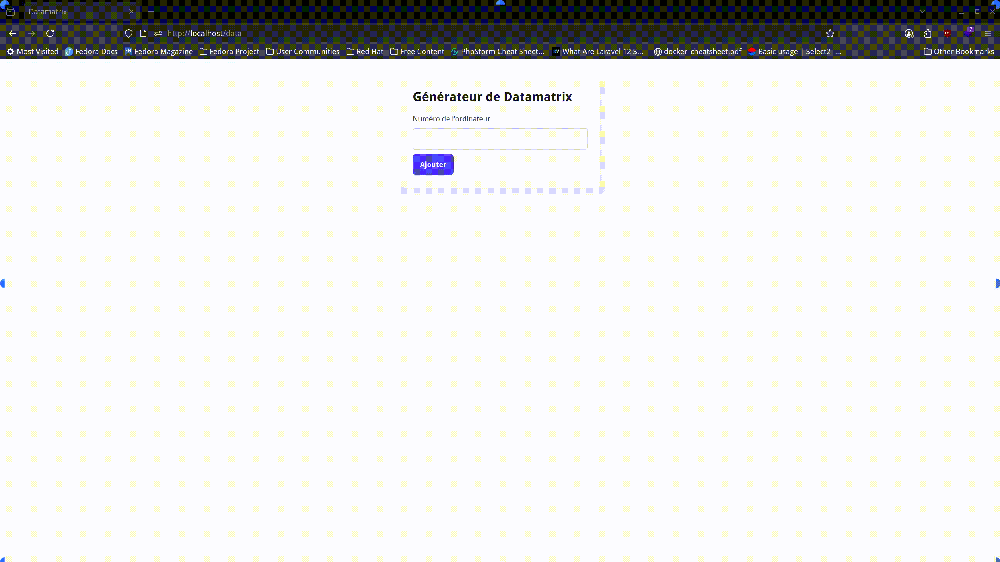

<h1 align="center">
  Ticket-Data
</h1>

<h4 align="center">Application de génération d'étiquettes</h4>



## Installation

> [!WARNING]
> Pour installer l'application, vous devez disposer de Docker et de crédentials pour accéder à l'API de GLPI.

```bash
# Clone ce repository
$ git clone https://github.com/jobtrek/ticket-data
```

```bash
# Aller dans le répertoire du projet
$ cd ticket-data
```

```bash
# Copier le fichier .env.example en .env
$ cp .env.example .env
```

> [!NOTE]
> Mettre à jour les variables d'environnement **USER_TOKEN** et **APP_TOKEN** dans le fichier .env

```bash
# Run les dépendances dans un conteneur Docker
$ docker run --rm \
    -u "$(id -u):$(id -g)" \
    -v "$(pwd):/var/www/html" \
    -w /var/www/html \
    laravelsail/php84-composer:latest \
    composer install --ignore-platform-reqs
```

```bash
# Lancer Sail (en arrière-plan)
./vendor/bin/sail up -d
```

```bash
# Générer la clé d'application
./vendor/bin/sail artisan key:generate
```

```bash
# Créer la base de données
./vendor/bin/sail artisan migrate
```

```bash
# Lancer le serveur de développement pour le front-end
npm run dev
```

## Usage

Ouvrir l'application dans votre navigateur à l'adresse: [http://localhost/data](http://localhost/data).

## Améliorations
Comme j'ai fusionné mon projet en PHP brute avec celui en laravel, il y a des améliorations à faire:
- [ ] Refactoriser le code pour utiliser les composants de Laravel
- [ ] Prendre les features des fichiers qui sont dans le dossier `\oldsrc` et les intégrer dans le projet ou les supprimer
- [ ] Ajouter la génération de datamatrix avec l'API de GLPI
- [ ] Pouvoir générer des étiquettes à partir d'un fichier CSV (ou autre format)